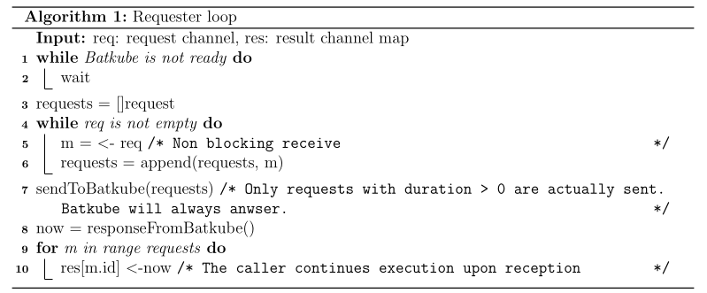
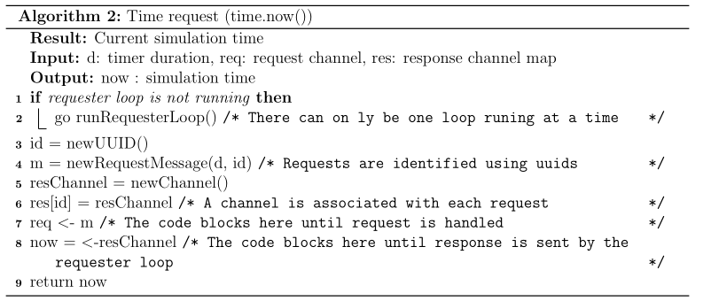

# batsky-go

Modified Go time library for Kubernetes schedulers running on a Batsim
simulation through Batkube.

It redirects all calls trying to get machine time to the Batkube message
broker.

## Usage
This library must be installed with
https://github.com/oar-team/batsky-go-installer . The rest of the
instructions are there.

## Principles
All calls get piled up in requester.go and sent to Batkube whenever the broker
says it is ready. The response, which is the current simulation time, is then
returned back to the original callers.

Timer requests break down to regular time requests, except they include a
non-zero duration parameter. Those requests are forwarded to Batsim in the form
of a CALL_ME_LATER event which will be anwsered with a REQUESTED_CALL when the
timer is supposed to fire.

### zmq exchanges breakdown
One exchange starts of with a "handshake" initiated by the broker (Batkube),
which tells the requester (in the time package) it is ready to process the time
requests. From there, the requester consumes all pending requests from the
scheduler and forwards them to the broker.

If the requester has nothing to forward to Batkube, an empty message is sent
anyways so as not to slow down the simulation.

Here is a diagram to better illustrate those exchanges.

### Requester inner mechanics
`requester.go` is composed of two main functions :
* `RequestTime` sends the requests to the main loop. There are multiple
instances of these at a time. Calls to `RequestTime` are unpredictable, and
untracable (to the best of our knowledge).
* The main loop `run` handles all requests, forwards them to Batkube and
sends over the current simulation time to all callers of `RequestTime`.

Here is the main loop pseudo-algorithm : 

And here is how `RequestTime` unfolds :

