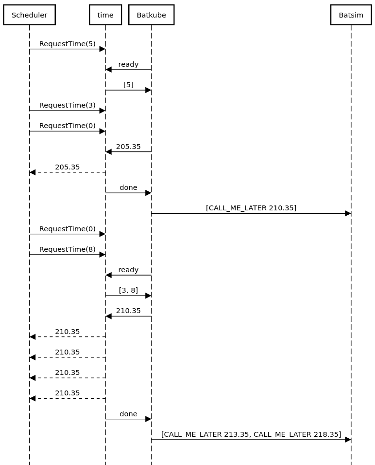

# batsky-go

Modified Go time library for Kubernetes schedulers running on a Batsim
simulation through Batkube.

It redirects all calls trying to get machine time to the Batkube message
broker.

## Usage
Simply replace the "time" import to this repo's time
("github.com/oar-team/batsky-go/time") in any dependancy where you want to
redirect time calls.

## Principles
All calls get piled up in requester.go and sent to Batkube whenever the broker
says it is ready. The response, which is the current simulation time, is then
returned back to the original callers.

Timer requests break down to regular time requests, except they include a
non-zero duration parameter. Those requests are forwarded to Batsim in the form
of a CALL_ME_LATER event which will be anwsered with a REQUESTED_CALL when the
timer is supposed to fire.

This is essential to the scheduler, otherwise it
would have to wait for the next simulation event which would maybe not happen
for a while (insumulation time) to get an update on the time and wake the
timers up.

### zmq exchanges breakdown
One exchange starts of with a "handshake" initiated by the broker, which tells
the requester it is ready to process the time requests. From there, the
requester consumes all pending requests and forwards them to the broker.

This allows requests from the scheduler to be taken into account while the
requester is waiting for the borker to be able to receive the message. The
pending requests would otherwise be sent on the next exchange, introducing a
delay which could be harmful to the scheduler and the simulation in general.
Other requests can still happen while the message is being processed to be
sent over zmq but we can't do much about them : nothing tells us wether the
shceduler will send other requests once we have consumed all pending requests.

Whether the requester has to wait for any time requests to come up to even send
a message to Batsim is a design decision we have to make.

Here is a diagram to better illustrate those exchanges.



Side note : it will be changed to have something like this:
```
<-ready
[d, ...]->
<-now
->done
```
This will remove one socket on each side with the same amount of exchanges. It
should have been like that since the beginning.

### Requester inner mechanics

TODO : requester pseudo algorithms

